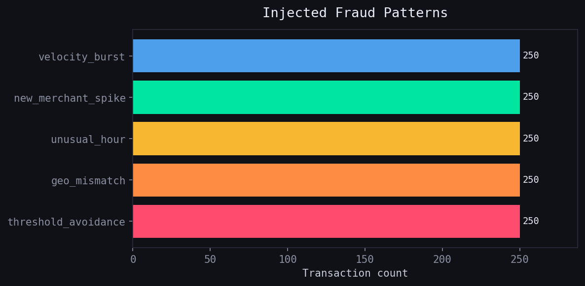
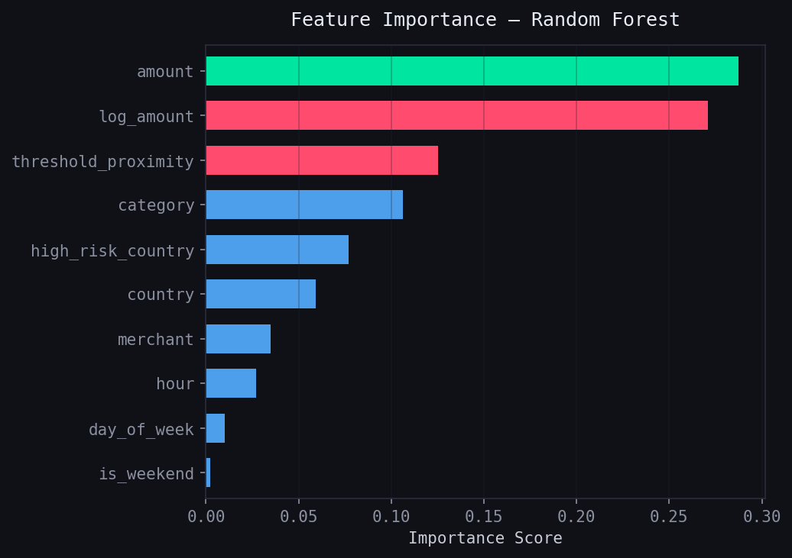
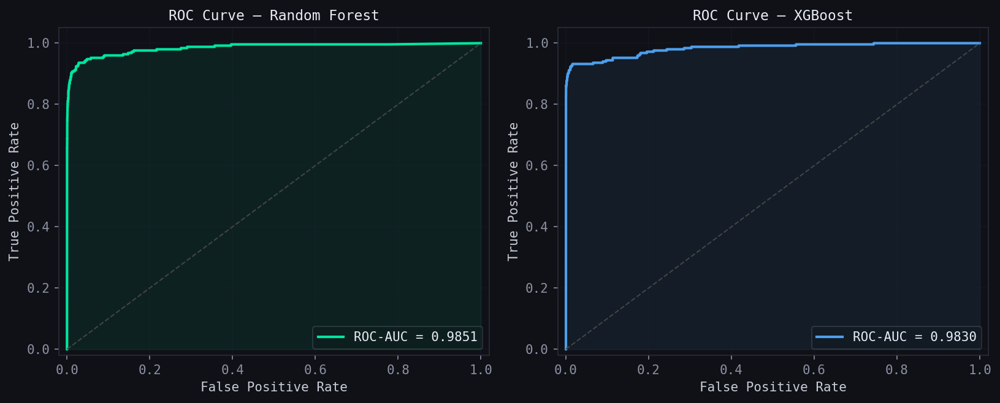
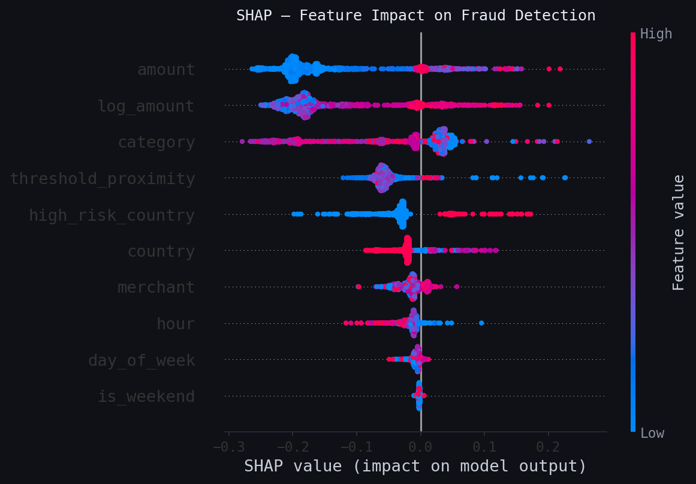
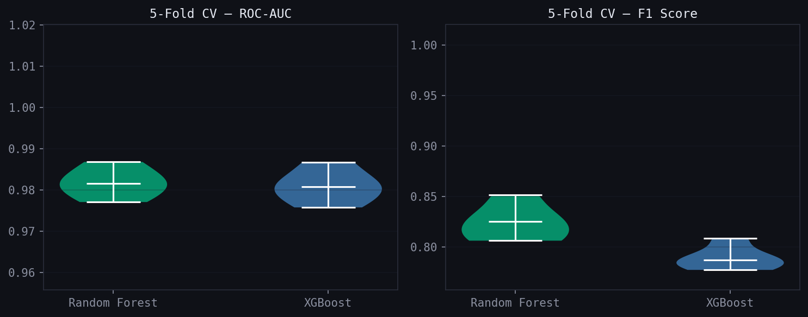

# SynthAudit

A synthetic financial transaction dataset generator with injected fraud patterns, used to train and evaluate ML-based fraud detection models.

---

## Objective

Most public fraud datasets are either too small, heavily anonymized, or stripped of the behavioral context that makes fraud detection interesting. This project solves that by generating a realistic dataset from scratch — with full control over the fraud patterns injected — and using it to train and evaluate multiple classifiers.

The goal is to demonstrate an end-to-end Risk Analytics pipeline: from data design, through feature engineering, to rigorous model evaluation.

---

## Results

| Model | ROC-AUC (5-fold CV) | F1 — Fraud Class |
|---|---|---|
| Random Forest | **0.9817 ± 0.0033** | 0.8233 ± 0.0166 |
| XGBoost | 0.9809 ± 0.0036 | 0.7888 ± 0.0106 |

Hold-out set (20%):

| | Precision | Recall | F1 |
|---|---|---|---|
| Legit | 1.00 | 0.99 | 1.00 |
| Fraud | 0.79 | 0.87 | 0.83 |

The model catches **87% of fraud cases** with a **0.21% false positive rate** — realistic numbers for a system designed to trigger early alerts before chargebacks occur.

---

## Figures

| Fraud Patterns | Feature Importance |
|---|---|
|  |  |

| ROC Curves | SHAP — What Drives Fraud Predictions |
|---|---|
|  |  |

| 5-Fold Cross-Validation |
|---|
|  |

---

## Project Structure

```
SynthAudit/
├── data/
│   ├── raw/               # Generated transaction data (not tracked by Git)
│   └── processed/         # Preprocessed features
├── notebooks/
│   ├── 01_eda_and_patterns.ipynb       # EDA and fraud visualization
│   └── 02_fraud_detection_model.ipynb  # Model training and evaluation
├── outputs/
│   └── figures/           # All generated charts
├── references/            # Academic references
├── src/
│   └── data_generator.py  # Synthetic data generation script
├── requirements.txt
└── README.md
```

---

## Why Synthetic Data

Generating synthetic data instead of using a public dataset was the primary research interest. The goal was to test whether artificially generated data — designed with explicit behavioral assumptions — can effectively train a model to detect patterns that mirror real-world fraud.

This matters beyond this project. If synthetic data can reliably feed a fraud detection model, the same methodology can be extended to train specialized systems capable of automated risk analysis — without depending on sensitive or restricted real-world datasets. This project is a first validation of that pipeline.

The immediate tradeoff is that synthetic patterns are structurally cleaner than real-world data, which partially explains the high AUC scores. That is expected and documented. The more important result is that the pipeline works, and produces **credible, non-trivial metrics** even with a harder problem setup:

- 50,000 transactions (vs 1,000 in v1)
- 2.5% fraud rate (up from 5% — harder class imbalance)
- 5 fraud patterns (vs 3 in v1)
- 5-fold stratified cross-validation (vs a single 80/20 split)
- Two competing models (Random Forest vs XGBoost)
- SHAP explainability

---

## Fraud Patterns

Five patterns were injected, each reflecting documented real-world fraud behavior:

**1. Unusual hour transactions** — Fraudulent activity between 1–4 AM, paired with elevated amounts and high-risk country codes. Legitimate cardholders rarely transact at those hours.

**2. Threshold avoidance** — Amounts set just below common detection thresholds ($499, $999, $4,999). This mimics *structuring*, where fraudsters deliberately stay under automated alert limits.

**3. New merchant spikes** — Large transactions from merchant entities that do not appear in the legitimate transaction history. Unfamiliar merchants with no prior relationship are a recognized risk signal.

**4. Velocity burst** — Multiple transactions from the same card within 15 minutes. Rapid successive charges are a classic sign of a compromised card being tested or drained.

**5. Geographic mismatch** — High-value transactions from high-risk countries for cards with a domestic baseline. Country-of-origin mismatch is a primary signal in card-present fraud.

Dataset was set at **2.5% fraud rate** — consistent with real card fraud benchmarks — to preserve the class imbalance that makes detection non-trivial.

---

## Methodology

**Data generation** — `src/data_generator.py` generates 48,750 legitimate and 1,250 fraudulent transactions across 5 patterns. Legitimate transactions follow realistic hour distributions, amount ranges per merchant category, and a 90% domestic / 10% international country split. The entire 50,000-row dataset generates in under one second, making scaling to millions of rows trivial.

**Feature engineering** — Beyond the raw transaction fields, two engineered features are added:
- `high_risk_country` — binary flag for countries with elevated fraud rates
- `threshold_proximity` — distance from the nearest common detection threshold ($500, $1k, $5k)
- `log_amount` — log-transformed amount to stabilize variance

**Model selection** — Random Forest and XGBoost were selected for their complementary strengths: RF handles mixed feature types natively and provides interpretable importance scores; XGBoost is gradient-boosted and typically performs better on imbalanced datasets. Both were tuned with class-weight balancing to prevent the majority class from dominating.

**Evaluation** — Models are evaluated using **5-fold stratified cross-validation** to produce stable, variance-aware estimates. Final metrics on the held-out 20% set: Precision, Recall, F1, Confusion Matrix, and ROC-AUC. **Recall on the fraud class was prioritized** — in fraud detection, missing a real fraud (false negative) is more costly than raising a false alarm.

**Explainability** — SHAP (SHapley Additive exPlanations) values are computed for the Random Forest to show which features drive individual predictions, not just global importance scores.

---

## Stack

- Python 3.10+
- pandas, numpy
- scikit-learn (RandomForestClassifier, StratifiedKFold)
- xgboost
- shap
- matplotlib, seaborn
- Jupyter Notebook

```bash
pip install -r requirements.txt
python src/data_generator.py        # generate data/raw/transactions.csv
jupyter notebook notebooks/         # run the analysis
```

---

## References

Breiman, L. (2001). *Random Forests*. Machine Learning, 45, 5–32.  
https://doi.org/10.1023/A:1010933404324

Chen, T., & Guestrin, C. (2016). *XGBoost: A scalable tree boosting system*. KDD '16.  
https://doi.org/10.1145/2939672.2939785

Lundberg, S. M., & Lee, S.-I. (2017). *A unified approach to interpreting model predictions*. NeurIPS.  
https://arxiv.org/abs/1705.07874

---

## Author

Lautaro Ramos  
GitHub: https://github.com/lautaro22ramos-wq  
LinkedIn: https://www.linkedin.com/in/lr22/
